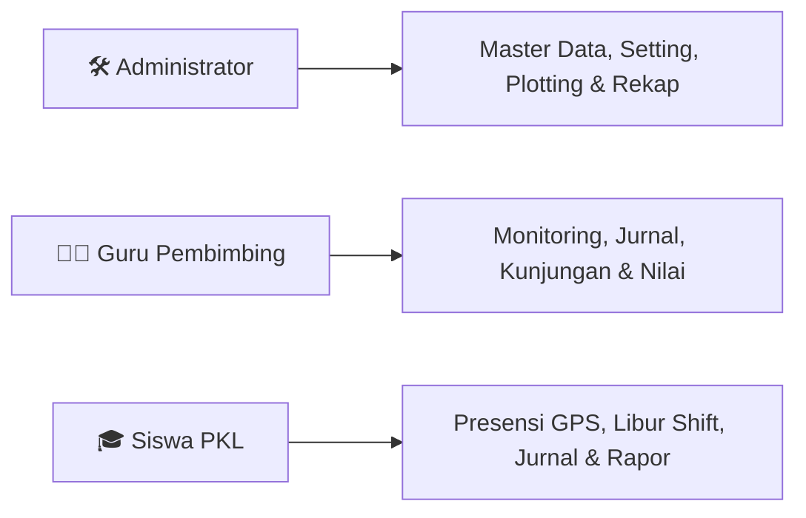

# 📖 Panduan Penggunaan Sistem PKLku (Howto PKLku)

Sistem **PKLku** adalah platform terintegrasi berbasis web (*web application*) untuk mempermudah monitoring, administrasi, presensi berbasis geofence dan selfie, jurnal kegiatan 5W+1H, kunjungan monitoring, evaluasi penilaian, serta pencetakan laporan dan rapor Praktek Kerja Lapangan (PKL) secara digital.

---

## 🔑 Kredensial Login Bawaan (Default Credentials)

Seluruh pengguna masuk ke sistem menggunakan **Alamat Email** dan **Password** masing-masing. Di bawah ini adalah akun uji coba bawaan (*database seeders*) yang siap digunakan:

### 1. Administrator Sekolah
* **Role**: Admin
* **Email**: `admin@pklsmk.sch.id`
* **Password**: `admin123`

### 2. Guru Pembimbing
* **Role**: Guru
* **Password Global**: `guru123`
* **Daftar Akun Uji Coba**:
  * `budi@pklsmk.sch.id` (Budi Hermawan, S.Kom)
  * `siti@pklsmk.sch.id` (Siti Aminah, M.T)
  * `hendro@pklsmk.sch.id` (Hendro Wibowo, S.Pd)

### 3. Siswa (Murid PKL)
* **Role**: Murid
* **Password Global**: `murid123`
* **Daftar Akun Uji Coba**:
  * `ahmad@pklsmk.sch.id` (Ahmad Fauzi)
  * `citra@pklsmk.sch.id` (Citra Lestari)
  * `danu@pklsmk.sch.id` (Danu Wijaya)
  * `eka@pklsmk.sch.id` (Eka Saputri)

---

## 🛠️ Panduan Operasional Berdasarkan Peran

---

## 1. 🛠️ Panduan untuk Administrator Sekolah

Admin memegang wewenang penuh atas konfigurasi awal, master data sekolah, plotting penempatan, kebijakan shift kerja, serta penerbitan laporan akhir.

### Langkah 1: Pengaturan Parameter & Branding Sekolah (`/setting`)
1. **Tab Branding & Sekolah**:
   - Masukkan **Nama Sekolah Resmi**, **Alamat Lengkap**, dan **Kabupaten / Kota Sekolah** (digunakan otomatis pada titimangsa dokumen PDF).
   - Unggah **Logo Sekolah** resmi (format PNG/JPG/SVG) atau pilih gunakan icon bawaan.
   - Masukkan **Nama Kepala Sekolah & NIP** untuk lembar pengesahan Rapor Nilai PKL.
   - Atur teks **Petunjuk Footer Rapor** dan **Copyright Login**.
2. **Tab Jam Kerja & Geofence**:
   - Atur jam buka masuk, batas toleransi terlambat, dan jam pulang untuk **Shift Reguler**, **Shift Pagi**, **Shift Siang**, dan **Shift Sore**.
   - Tentukan **Jarak Radius Geofence Default** (misal: `50` meter).
   - Tentukan **Kuota Libur Shift Mingguan** (misal: `2` hari untuk skema 5 hari kerja, atau `1` hari untuk skema 6 hari kerja).
3. **Tab Bobot Nilai Rapor**:
   - Tentukan persentase kontribusi nilai sekolah vs industri (contoh: 50% Guru, 50% DUDI).

### Langkah 2: Kelola Data Master (`/master-data/*`)
1. **Tahun Ajaran**: Tambahkan dan aktifkan tahun ajaran berjalan (contoh: `2026/2027`).
2. **Jurusan & Kelas**: Tambahkan data kompetensi keahlian dan kelas siswa.
3. **Master Hari Libur**: Klik tombol **"Sinkronisasi Hari Libur Nasional"** untuk menarik tanggal merah secara otomatis, atau tambahkan hari libur khusus sekolah secara manual.
4. **Data Siswa & Guru**: Tambahkan akun perorangan atau gunakan fitur **Impor Excel Massal**. Admin juga dapat melakukan **Reset Password Massal** jika diperlukan.
5. **Data Mitra DUDI**: Daftarkan nama industri/perusahaan, nama PIC industri & nomor kontak WhatsApp, alamat, serta **Titik Koordinat (Latitude & Longitude)** dan **Radius Toleransi Khusus** menggunakan peta interaktif.

### Langkah 3: Plotting Penempatan Siswa (`/penempatan`)
1. Klik **"Tambah Penempatan"** atau gunakan **"Plotting Penempatan Massal"** untuk memasangkan banyak siswa sekaligus dari kelas yang sama ke satu Mitra DUDI.
2. Tentukan **Guru Pembimbing Sekolah** dan nama **Pembimbing Industri**.
3. Pilih **Skema Kerja**:
   - `100% WFO`: Siswa wajib hadir di lokasi kantor DUDI (dalam radius geofence).
   - `100% WFA`: Siswa bebas melakukan presensi dari mana saja tanpa batasan geofence.
   - `Hybrid`: Pilih hari-hari tertentu siswa bekerja secara WFA (misal: *Rabu & Jumat*).
4. Pilih **Pengaturan Shift Kerja**:
   - `Reguler`: Mengikuti jam kerja standar sekolah (`06:00 - 15:00`).
   - `Shift Pagi` / `Shift Siang` / `Shift Sore`: Mengikuti template shift DUDI.
   - `Rolling Shift`: Sistem secara cerdas melakukan *auto-detect* shift pagi/siang/sore berdasarkan waktu siswa melakukan check-in masuk.
   - `Kustom Jam`: Admin menentukan jam masuk, batas telat, dan jam pulang secara bebas (misal: industri ritel `14:00 - 21:00`).
5. Tentukan **Jadwal Libur Rutin Siswa** (misal: *Sabtu & Minggu*, atau *Minggu saja*).

### Langkah 4: Pengawasan Presensi & Input Manual (`/presensi`)
1. Admin dapat memantau kehadiran harian seluruh siswa secara *realtime* (termasuk status: Tepat Waktu, Terlambat, Libur Shift, Pulang Cepat, Izin, Sakit, atau Alpha).
2. Jika ada siswa yang terkendala gawai/sinyal, Admin dapat menambahkan data kehadiran melalui tombol **"Input Presensi Manual"** atau melakukan **"Koreksi Presensi"**.

### Langkah 5: Buka Masa Penilaian & Pusat Laporan (`/laporan`)
1. Ketika masa PKL mendekati akhir, Admin mengaktifkan tombol saklar **"Buka Masa Penilaian"** pada menu Penilaian.
2. Di menu **Pusat Laporan**, Admin dapat:
   - **Ekspor Rekapitulasi Presensi**: Format **PDF Resmi** (Portrait untuk Harian, Landscape untuk Mingguan/Bulanan/Kustom) atau format **Excel (.xlsx)**.
   - **Ekspor Rekapitulasi Jurnal**: Format **PDF Dokumen** (per rentang tanggal atau per siswa spesifik).
   - **Tabel Akses Cepat Dokumen Siswa**: Unduh langsung file Presensi PDF, Jurnal PDF, dan Rapor Nilai PDF per masing-masing siswa.

---

## 2. 👨‍🏫 Panduan untuk Guru Pembimbing Sekolah

Guru Pembimbing bertugas mendampingi siswa bimbingannya, memvalidasi jurnal kegiatan harian, melakukan kunjungan ke industri, dan mengesahkan nilai akhir.

### Langkah 1: Pemantauan Harian & Peta Presensi Siswa (`/dashboard` & `/monitoring`)
1. Pada **Dashboard**, Guru dapat melihat statistik ringkas dan **Peta Sebaran Titik Presensi Siswa Bimbingan** beserta foto selfie *check-in/check-out*.
2. Memeriksa status kehadiran siswa (apakah hadir, terlambat, izin, sakit, libur shift, atau alpha).

### Langkah 2: Validasi Jurnal Kegiatan Harian (`/jurnal`)
1. Masuk ke menu **Jurnal Kegiatan** (notifikasi lonceng akan memberi tahu jumlah jurnal baru yang berstatus *Menunggu*).
2. Baca rincian aktivitas siswa (format kaidah 5W+1H) dan periksa foto dokumentasi pekerjaan siswa.
3. Berikan aksi:
   - Klik **"Setujui"** jika kegiatan sesuai dan terdokumentasi dengan baik.
   - Klik **"Tolak / Revisi"** disertai catatan arahan edukatif jika laporan kegiatan belum jelas atau tidak lengkap.

### Langkah 3: Persetujuan Pengajuan Surat Izin / Sakit (`/presensi/izin`)
1. Buka menu **Izin & Sakit**.
2. Tinjau permohonan izin siswa bimbingan (alasan, rentang hari, dan lampiran surat dokter/surat izin orang tua).
3. Berikan persetujuan (**Setujui**) atau penolakan (**Tolak**). Data siswa yang izin/sakit otomatis tercatat pada rekap kehadiran tanpa terkena sanksi Alpha.

### Langkah 4: Pencatatan Laporan Kunjungan Monitoring DUDI (`/kunjungan`)
1. Masuk ke menu **Kunjungan Monitoring**.
2. Klik **"Tambah Kunjungan"**, pilih Mitra DUDI yang dikunjungi, tanggal kunjungan, jenis kunjungan (*Pengantaran, Monitoring Rutin, Evaluasi Tengah, Penjemputan*).
3. Tulis catatan hasil evaluasi dari pembimbing industri dan wajib unggah **Foto Dokumentasi Kunjungan**.
4. Guru dapat mengunduh **Laporan Kunjungan PDF** resmi sebagai bukti fisik pelaksanaan tugas pembimbingan.

### Langkah 5: Verifikasi Nilai DUDI & Pengesahan Rapor Akhir (`/penilaian`)
1. Ketika masa penilaian telah dibuka oleh Admin dan siswa telah menginput nilai DUDI, buka menu **Penilaian PKL**.
2. Klik tombol **"Lihat Berkas Fisik"** untuk memeriksa keaslian lembar nilai fisik dari industri (tanda tangan & cap basah DUDI).
3. Input **Nilai Aspek Sekolah** (Laporan PKL, Sikap/Softskill, Presentasi/Ujian).
4. Tinjau / sesuaikan narasi **Keterangan Capaian per Tujuan Pembelajaran (TP)**.
5. Klik **"Simpan & Sahkan Penilaian"**. Nilai akhir gabungan akan terhitung otomatis dan dokumen **Rapor Penilaian PKL (PDF)** langsung terbit serta siap dicetak.

---

## 3. 🎓 Panduan untuk Siswa (Murid PKL)

Siswa melaksanakan presensi harian, mencatat jurnal aktivitas, mengajukan izin, serta mengunggah nilai industri menggunakan ponsel pintar (*smartphone*).

### Langkah 1: Memeriksa Informasi Penempatan (`/dashboard`)
1. Setelah login, periksa kartu informasi penempatan: Nama Mitra DUDI, Alamat & Radius Geofence, Nama Guru Pembimbing & Pembimbing Lapangan, serta Skema Kerja (WFO / WFA / Hybrid).
2. Perhatikan jadwal jam kerja masuk & pulang sesuai shift yang ditetapkan.

### Langkah 2: Presensi Harian Masuk & Pulang (`/presensi`)
1. **Presensi Datang (Masuk)**:
   - Buka menu **Presensi** di awal jam kerja.
   - Pastikan **GPS ponsel aktif** dan browser diberikan izin akses lokasi & kamera.
   - Indikator jarak akan menghitung posisi Anda ke titik DUDI. Jika berada di dalam radius (atau hari tersebut berstatus WFA), preview kamera selfie akan terbuka.
   - Ambil foto selfie di lingkungan kerja dan klik **"Check In Sekarang"**. Foto selfie otomatis dibubuhi watermark tanggal, waktu, koordinat, dan status kerja.
2. **Presensi Pulang**:
   - Saat jam kerja berakhir, buka kembali menu **Presensi**, ambil foto selfie kepulangan, dan klik **"Check Out Sekarang"**.

### Langkah 3: Menggunakan Fitur "Libur Shift Mandiri" (Untuk Jadwal Roster/Rolling)
1. Jika tempat DUDI menerapkan sistem libur bergantian (*rolling day-off* / tidak libur di hari Sabtu/Minggu standar), siswa tidak perlu meminta admin mengubah jadwal.
2. Pada hari libur shift, buka menu **Presensi**.
3. Di bagian bawah, klik tombol **"🌴 Tandai Libur Shift Hari Ini"** (sistem menampilkan sisa kuota mingguan Anda, misal: *2 hari/minggu*).
4. Halaman presensi otomatis beralih ke status Libur Shift dan Anda **aman dari sanksi Alpha Cron Job**.
5. Jika mendadak ada panggilan masuk kerja dari supervisor DUDI, klik tombol **"Batalkan Libur (Masuk Bekerja)"** untuk kembali membuka tombol Check-In presensi.

### Langkah 4: Pengisian Jurnal Harian 5W+1H (`/jurnal`)
1. Buka menu **Jurnal Harian** setiap selesai jam kerja.
2. Tuliskan deskripsi pekerjaan secara jelas dengan panduan prinsip **5W + 1H**:
   - **What**: Apa tugas/pekerjaan yang dikerjakan hari ini?
   - **Why**: Apa tujuan/manfaat pekerjaan tersebut?
   - **Where**: Di divisi/ruangan/area mana tugas dilaksanakan?
   - **When**: Kapan waktu dan berapa lama pelaksanaannya?
   - **Who**: Di bawah instruksi siapa tugas tersebut dikerjakan?
   - **How**: Bagaimana langkah-langkah teknis pengerjaan dan hasilnya?
3. Unggah 1 foto dokumentasi pekerjaan (hasil produk, proses kerja, atau kegiatan industri).
4. Klik **"Kirim Jurnal"** untuk diperiksa oleh Guru Pembimbing. Jika status jurnal menjadi *Perlu Revisi*, baca catatan guru dan klik *Edit Jurnal* untuk memperbaiki.

### Langkah 5: Pengajuan Permohonan Izin / Sakit (`/presensi/izin`)
1. Jika berhalangan hadir karena sakit atau urusan keluarga darurat, buka menu **Izin & Sakit**.
2. Klik **"Ajukan Izin/Sakit"**, pilih kategori (*Sakit* atau *Izin*), tentukan rentang tanggal, tuliskan alasan jelas, dan lampirkan foto surat dokter atau surat permohonan orang tua.
3. Notifikasi lonceng akan menginformasikan jika permohonan telah disetujui oleh Guru Pembimbing.

### Langkah 6: Input Nilai DUDI & Unggah Bukti Fisik (`/penilaian`)
1. Di akhir masa PKL, mintalah lembar sertifikat/penilaian asli bermeterai/cap basah dari pembimbing industri DUDI.
2. Ketika masa penilaian telah dibuka oleh Admin, buka menu **Penilaian PKL**.
3. Masukkan nilai angka untuk setiap indikator industri sesuai yang tertera pada lembar fisik.
4. Tuliskan deskripsi ringkas capaian kompetensi pada masing-masing Tujuan Pembelajaran (TP).
5. Unggah foto/scan **Lembar Bukti Fisik Nilai DUDI** (JPG, PNG, atau PDF).
6. Klik **"Kirim Nilai DUDI"**.

### Langkah 7: Pengunduhan Rapor Nilai PKL PDF Resmi (`/penilaian`)
1. Setelah Guru Pembimbing memverifikasi berkas fisik dan mengesahkan nilai akhir, status berubah menjadi **"Sudah Diverifikasi & Disahkan"**.
2. Klik tombol **"📄 Unduh Rapor Nilai PKL (PDF)"** untuk mendapatkan dokumen rapor resmi sekolah lengkap dengan nilai konversi huruf, predikat kelulusan, dan tanda tangan digital kepala sekolah/pembimbing.

---

## 💡 Troubleshooting & FAQ

| Kendala | Penyebab Umum | Solusi Praktis |
|---|---|---|
| **GPS di luar radius (Merah)** | Posisi siswa masih jauh dari titik DUDI atau akurasi GPS HP lemah. | Pastikan sudah berada di kantor DUDI, aktifkan mode *High Accuracy GPS*, dan buka Google Maps sebentar untuk mengunci sinyal GPS. |
| **Kamera selfie tidak muncul / blank** | Izin kamera diblokir oleh browser Chrome/Safari. | Klik ikon gembok/pengaturan di address bar browser, ubah izin Kamera (*Camera Permission*) menjadi **Allow (Izinkan)**, lalu refresh halaman. |
| **Gagal Check-In (Di luar jam buka)** | Siswa mencoba presensi sebelum jam buka shift atau setelah jam tutup. | Lakukan presensi sesuai rentang jadwal shift yang telah ditentukan sekolah/DUDI. |
| **Tidak bisa input nilai DUDI** | Admin belum mengaktifkan masa penilaian. | Hubungi Admin/Panitia PKL sekolah untuk mengaktifkan saklar *"Buka Masa Penilaian"*. |
| **Lupa Password Akun** | Pengguna lupa sandi login. | Hubungi Administrator Sekolah untuk melakukan reset sandi via menu Master Data. |
