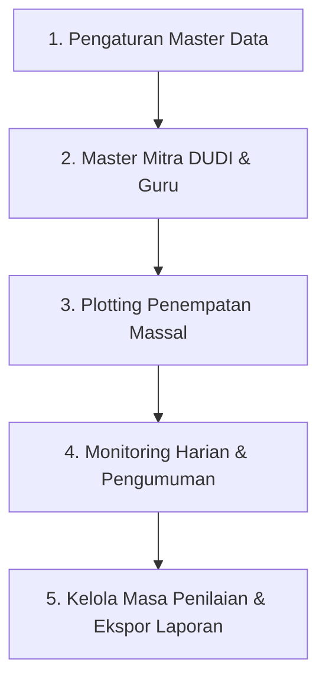
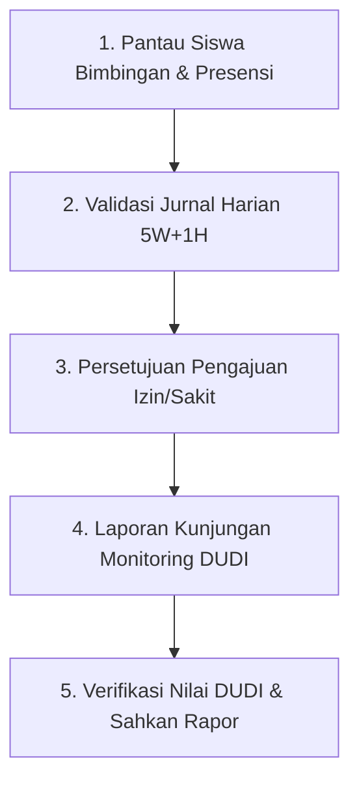
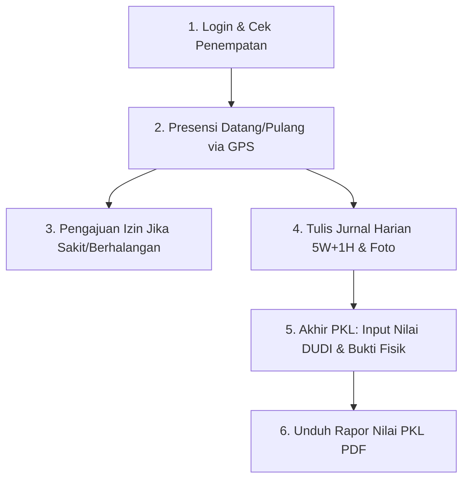

# 📘 Panduan Alur Kerja Lengkap Sistem Informasi PKL (PKLku)

Dokumen ini berisi panduan alur kerja (*standard operating procedure / workflow*) operasional aplikasi **PKLku** untuk tiga peran pengguna: **Administrator (Panitia PKL)**, **Guru Pembimbing Sekolah**, dan **Murid (Siswa PKL)**.

---

## 🗺️ Diagram Alur Utama Sistem (End-to-End Workflow)

```mermaid
graph TD
    subgraph Fase 1: Persiapan & Master Data
        A[Admin: Setup Tahun Ajaran & Master Data] --> B[Admin: Plotting Penempatan Siswa, DUDI & Guru]
        B --> C[Siswa & Guru Mendapatkan Akun & Akses]
    end

    subgraph Fase 2: Pelaksanaan PKL (Operasional Harian)
        C --> D[Siswa: Presensi Datang & Pulang GPS/Selfie]
        C --> E[Siswa: Pengajuan Izin/Sakit jika Berhalangan]
        E --> F[Guru/Admin: Verifikasi & Persetujuan Izin]
        C --> G[Siswa: Tulis Jurnal Harian 5W+1H & Foto]
        G --> H[Guru: Periksa & Validasi Jurnal Siswa]
        C --> I[Guru: Kunjungan Monitoring DUDI & Catatan Evaluasi]
    end

    subgraph Fase 3: Pasca PKL & Penilaian Kelulusan
        J[Admin: Buka Saklar Masa Penilaian] --> K[Siswa: Input Nilai DUDI + Upload Lembar Fisik]
        K --> L[Guru: Verifikasi Nilai DUDI + Input Nilai Sekolah & TP]
        L --> M[Guru: Pengesahan Nilai Akhir PKL]
        M --> N[Siswa & Admin: Unduh Rapor Nilai PKL PDF]
        M --> O[Admin/Guru: Rekapitulasi Laporan Akhir & Arsip]
    end
```

---

## 1. 🛠️ Alur Kerja Administrator (Panitia PKL)

Administrator memegang kendali penuh atas manajemen data master, plotting penempatan, kebijakan operasional, pengumuman sekolah, serta rekapitulasi penilaian dan kehadiran.



### Tahap 1: Persiapan & Konfigurasi Master Data
1. **Manajemen Tahun Ajaran & Kelas**:
   - Menambahkan Tahun Ajaran aktif (misal: `2026/2027`).
   - Menyiapkan data Jurusan dan Kelas siswa.
2. **Sinkronisasi Hari Libur Nasional**:
   - Membuka menu **Master Hari Libur** dan klik tombol **Sinkronisasi Libur Nasional** otomatis (atau menambah libur khusus sekolah secara manual).
3. **Impor / Tambah Data Siswa & Guru**:
   - Menambahkan akun Guru dan Siswa via form atau fitur **Impor Excel Massal**.
   - Menyediakan fitur **Ekspor Excel** untuk rekap data master siswa, guru, dan DUDI.
   - Mengatur password default melalui menu **Pengaturan Aplikasi** atau melakukan **Reset Password Massal** jika ada siswa/guru yang lupa sandi.

### Tahap 2: Registrasi Mitra DUDI & Penentuan Radius Geolocation
1. **Pendaftaran Mitra DUDI**:
   - Memasukkan nama perusahaan/instansi, nama PIC & kontak WhatsApp, jam operasional, dan alamat lengkap.
   - Menentukan **titik koordinat (Latitude & Longitude)** dan **Radius Presensi (Meter)** menggunakan peta interaktif Google Maps agar presensi siswa akurat di lokasi PKL.

### Tahap 3: Plotting & Penempatan Siswa ke DUDI
1. **Plotting Massal Siswa**:
   - Memilih siswa-siswa dari kelas yang sama, menautkan ke Mitra DUDI tujuan, serta menunjuk Guru Pembimbing Sekolah dan Pembimbing Lapangan Industri.
2. **Pengaturan Model Kerja & Hari Libur Spesifik**:
   - Menentukan tipe kerja: **WFO (Work From Office)**, **WFA (Work From Anywhere)**, atau **Hybrid**.
   - Jika **Hybrid**, tentukan hari-hari siswa bekerja secara WFA (misal: *Rabu, Jumat*).
   - Menentukan jadwal **Hari Libur Rutin Siswa** (misal: *Sabtu & Minggu* untuk industri 5 hari kerja, atau *Minggu saja* untuk industri 6 hari kerja, atau hari kerja dinamis lainnya).
3. **Pengaturan Shift & Jam Kerja Siswa**:
   - Memilih template shift: **Shift Reguler**, **Shift Pagi**, **Shift Siang**, atau **Kustom Jam Khusus**.
   - Jika industri memiliki jam kerja khusus (misal: ritel/hotel `14:00 - 21:00`), Admin dapat mengetikkan jam masuk, batas toleransi terlambat, dan jam pulang secara mandiri tanpa terikat jam standar sekolah.

### Tahap 4: Pengumuman & Pengawasan Operasional
1. **Penerbitan Pengumuman**:
   - Mengunggah surat edaran atau informasi penting sekolah melalui menu **Pengumuman** dengan target penerima (*Semua, Murid, Guru, atau Kustom*).
2. **Pengawasan Real-Time**:
   - Memantau presensi dan jurnal yang masuk setiap hari melalui dashboard analitik.
   - Meninjau laporan kunjungan monitoring guru pembimbing.

### Tahap 5: Buka/Tutup Masa Penilaian & Ekspor Rekap
1. **Saklar Masa Penilaian**:
   - Ketika masa PKL mendekati akhir, Admin mengaktifkan tombol **"Buka Masa Penilaian"** di menu Penilaian agar siswa dan guru dapat mulai menginput nilai.
2. **Ekspor Rekapitulasi Data**:
   - Mengunduh rekapitulasi data dalam format Excel: **Data Murid**, **Data Guru**, **Data Mitra DUDI**, **Plotting Penempatan**, serta **Laporan Kehadiran Global**.

---

## 2. 👨‍🏫 Alur Kerja Guru Pembimbing Sekolah

Guru Pembimbing bertugas mendampingi, memvalidasi aktivitas harian, melakukan kunjungan berkala ke mitra DUDI, serta memproses nilai akhir kelulusan PKL.



### Tahap 1: Pemantauan Siswa Bimbingan & Presensi
1. **Dashboard Khusus Guru**:
   - Mengetahui daftar siswa yang menjadi tanggung jawab bimbingannya beserta lokasi DUDI masing-masing.
   - Memeriksa riwayat kehadiran harian siswa bimbingan (Tepat Waktu, Terlambat, WFA, atau Alpha).

### Tahap 2: Verifikasi & Catatan Jurnal PKL Siswa
1. **Memeriksa Jurnal Harian**:
   - Masuk ke menu **Jurnal Kegiatan**. Notifikasi lonceng akan memberi tahu jumlah jurnal baru berstatus *Menunggu*.
   - Membaca deskripsi pekerjaan siswa (yang disusun berdasarkan prinsip 5W + 1H) dan melihat foto dokumentasi kegiatan.
2. **Persetujuan & Umpan Balik**:
   - Menekan tombol **Setujui** jika jurnal sesuai.
   - Menekan tombol **Tolak / Minta Revisi** disertai catatan arahan edukatif jika pekerjaan belum lengkap atau format belum sesuai.

### Tahap 3: Persetujuan Surat Izin / Sakit
1. **Tinjau Pengajuan Izin**:
   - Masuk ke menu **Presensi > Izin & Sakit**.
   - Memeriksa tanggal izin, alasan ketidakhadiran, dan berkas surat dokter/surat orang tua pendukung.
2. **Memberikan Status**:
   - Menyetujui atau menolak permohonan izin dengan menyertakan catatan guru.

### Tahap 4: Pelaksanaan & Laporan Kunjungan Monitoring DUDI
1. **Menginput Agenda Kunjungan**:
   - Masuk ke menu **Kunjungan Monitoring**.
   - Memilih DUDI yang dikunjungi, tanggal kunjungan, mengisi catatan evaluasi perkembangan siswa dari pihak industri, serta mengunggah foto dokumentasi kunjungan bersama pembimbing industri.
2. **Cetak / Ekspor Laporan Kunjungan**:
   - Mengunduh rekapitulasi laporan kunjungan monitoring dalam bentuk PDF resmi untuk arsip sekolah.

### Tahap 5: Verifikasi Nilai DUDI, Input Nilai Sekolah, & Pengesahan Rapor
1. **Memeriksa Nilai dari Industri**:
   - Membuka menu **Penilaian PKL**. Notifikasi lonceng akan menandai siswa yang telah mengunggah nilai DUDI.
   - Membuka tautan pratinjau **Berkas Bukti Lembar Nilai Fisik DUDI** yang diunggah oleh siswa untuk mencocokkan keaslian nilai dan stempel/tanda tangan industri.
2. **Menginput Indikator Nilai Sekolah & Keterangan TP**:
   - Menginput nilai indikator internal sekolah (aspek soft skill, laporan, presentasi/ujian).
   - Meninjau Keterangan Capaian per Tujuan Pembelajaran (TP) yang diajukan siswa (atau menyesuaikannya jika diperlukan).
   - Mengisi catatan pembimbing keseluruhan.
3. **Pengesahan Nilai**:
   - Menekan tombol **"Simpan & Sahkan Penilaian"**. Nilai akhir secara otomatis dihitung dan rapor nilai PKL siap diterbitkan.

---

## 3. 🎓 Alur Kerja Murid (Siswa PKL)

Siswa melaksanakan kegiatan operasional PKL sehari-hari secara mandiri melalui antarmuka web yang responsif di ponsel (*smartphone*).



### Tahap 1: Informasi Penempatan & Profil PKL
1. **Dashboard Siswa**:
   - Siswa melihat detail penempatan: Nama Mitra DUDI, Alamat & Radius Lokasi, Nama Pembimbing Industri & Guru Pembimbing Sekolah, serta Model Kerja (WFO/WFA/Hybrid) dan jadwal hari liburnya.

### Tahap 2: Presensi Harian (Datang & Pulang)
1. **Presensi Masuk (Datang)**:
   - Membuka menu **Presensi**.
   - Mengaktifkan GPS ponsel. Jika sistem mendeteksi posisi siswa berada di dalam radius lokasi DUDI (atau jika hari tersebut terjadwal WFA), kamera selfie akan aktif.
   - Mengambil foto selfie langsung dan klik **"Kirim Presensi Masuk"**.
2. **Presensi Pulang**:
   - Setelah jam kerja berakhir, siswa kembali melakukan foto selfie dan mengirim presensi pulang.

### Tahap 3: Pengajuan Izin / Sakit (Jika Berhalangan Hadir)
1. **Mengajukan Izin**:
   - Jika siswa sakit atau memiliki urusan darurat yang sah, siswa membuka menu **Izin & Sakit**.
   - Memilih tipe (*Sakit* atau *Izin*), menentukan rentang tanggal, menuliskan alasan, dan melampirkan foto surat keterangan dokter / surat izin orang tua.
2. **Menerima Status**:
   - Notifikasi lonceng akan memberi tahu siswa jika pengajuan telah disetujui atau ditolak oleh Guru Pembimbing.

### Tahap 4: Pengisian Jurnal Kegiatan Harian (Kaidah 5W + 1H)
1. **Menulis Catatan Jurnal**:
   - Membuka menu **Jurnal Harian**.
   - Mengisi catatan kegiatan harian secara terstruktur menggunakan panduan kaidah **5W + 1H**:
     - **What:** Pekerjaan/tugas apa yang dikerjakan hari ini?
     - **Why:** Apa fungsi/kegunaan dari pekerjaan tersebut?
     - **Where:** Di bagian/divisi/lokasi mana tugas itu dilakukan?
     - **When:** Kapan waktu pengerjaannya?
     - **Who:** Bersama siapa / di bawah instruksi siapa pekerjaan dilaksanakan?
     - **How:** Bagaimana langkah-langkah teknis pengerjaan dan apa hasil akhirnya?
2. **Melampirkan Dokumentasi**:
   - Mengunggah foto hasil pekerjaan atau dokumentasi kegiatan kerja hari itu.
   - Mengirimkan jurnal untuk diperiksa oleh Guru Pembimbing.

### Tahap 5: Penginputan Nilai DUDI & Unggah Bukti Fisik (Akhir PKL)
1. **Menerima Lembar Nilai Fisik dari Industri**:
   - Di akhir masa PKL, siswa menerima lembar sertifikat/penilaian fisik asli yang telah dinilai, ditandatangani, dan dicap basah oleh Mitra DUDI.
2. **Input Nilai ke Sistem PKLku**:
   - Setelah masa penilaian dibuka oleh Admin, siswa membuka menu **Penilaian PKL**.
   - Menginput nilai angka untuk setiap butir indikator industri sesuai lembar fisik.
   - Mengisi deskripsi **Keterangan Capaian per Tujuan Pembelajaran (TP)** sesuai capaian yang diperoleh di tempat kerja.
   - Mengunggah foto/scan berkas lembar penilaian fisik (format JPG, PNG, atau PDF).
   - Menekan tombol **"Kirim Nilai DUDI & Bukti Fisik"**.

### Tahap 6: Penerbitan & Unduh Rapor Nilai PKL PDF
1. **Melihat Nilai Akhir**:
   - Setelah Guru Pembimbing memeriksa berkas bukti dan mengesahkan nilai akhir, status penilaian siswa akan berubah menjadi **"Sudah Diverifikasi & Disahkan"**.
2. **Unduh Rapor PDF**:
   - Siswa dapat langsung melihat nilai akhir (konversi predikat kelulusan) dan mengunduh dokumen resmi **Rapor Penilaian PKL (PDF)** lengkap dengan tanda tangan kepala sekolah/pembimbing.

---

## 🔔 Ringkasan Notifikasi Sistem (Lonceng Otomatis)

Sistem lonceng notifikasi di navbar atas bekerja secara cerdas dan otomatis:

| Kategori | Penerima | Pemicu Notifikasi |
|---|---|---|
| 📢 **Pengumuman Baru** | Semua Role | Terbitnya pengumuman baru sekolah dalam 7 hari terakhir. |
| 🎂 **Ulang Tahun Hari Ini** | Semua Role | Ucapan selamat ultah untuk diri sendiri & kabar ultah siswa bimbingan / teman sekelas. |
| 📝 **Pengingat Jurnal** | Murid | Siswa belum mengisi jurnal di hari kerja aktif (sore hari). |
| 📝 **Verifikasi Jurnal** | Guru | Ada jurnal siswa bimbingan baru yang menunggu diperiksa. |
| 📋 **Persetujuan Izin** | Guru & Admin | Ada siswa yang mengajukan permohonan surat izin/sakit baru. |
| 📋 **Status Izin** | Murid | Pemberitahuan bahwa permohonan izinnya telah Disetujui / Ditolak. |
| 🏆 **Masa Penilaian Buka** | Murid | Admin mengaktifkan masa input nilai PKL. |
| 🏆 **Verifikasi Nilai DUDI**| Guru | Siswa telah mengunggah nilai DUDI & bukti lembar fisik. |
| 🎓 **Rapor PKL Terbit** | Murid | Nilai akhir telah disahkan guru dan siap diunduh. |

---

## 📊 Matriks Fitur & Hak Akses Peran

| Fitur / Modul | Administrator | Guru Pembimbing | Siswa / Murid |
|---|:---:|:---:|:---:|
| **Konfigurasi Tahun Ajaran, Jurusan, Kelas, Libur** | ✅ Penuh | ❌ | ❌ |
| **Kelola Master Guru & Mitra DUDI** | ✅ Penuh | ❌ | ❌ |
| **Kelola & Reset Password Siswa** | ✅ Penuh | ❌ | ❌ |
| **Plotting Penempatan Siswa (WFO/WFA/Libur)** | ✅ Penuh | ❌ | ❌ |
| **Ekspor Excel (Murid, Guru, DUDI, Plotting)** | ✅ Penuh | ❌ | ❌ |
| **Presensi GPS & Selfie Masuk/Pulang** | ❌ | ❌ | ✅ Mandiri |
| **Pengajuan Izin / Sakit** | ❌ | ❌ | ✅ Mandiri |
| **Persetujuan Izin / Sakit** | ✅ Backup | ✅ Utama | ❌ |
| **Tulis Jurnal Harian 5W+1H** | ❌ | ❌ | ✅ Mandiri |
| **Pemeriksaan & Validasi Jurnal** | ❌ | ✅ Utama | ❌ |
| **Input Laporan Kunjungan Monitoring DUDI** | ✅ Monitoring | ✅ Utama | ❌ |
| **Buka/Tutup Saklar Masa Penilaian** | ✅ Penuh | ❌ | ❌ |
| **Input Nilai DUDI + Upload Lembar Bukti Fisik** | ❌ | ❌ | ✅ Mandiri |
| **Verifikasi Nilai DUDI & Input Nilai Sekolah** | ❌ | ✅ Utama | ❌ |
| **Cetak / Unduh Rapor Nilai PKL PDF** | ✅ Penuh | ✅ Penuh | ✅ Mandiri |
| **Penerbitan Pengumuman Sekolah** | ✅ Penuh | ❌ | ❌ |

---

*Dokumen ini dibuat otomatis sebagai panduan operasional standar implementasi aplikasi **PKLku**.*
