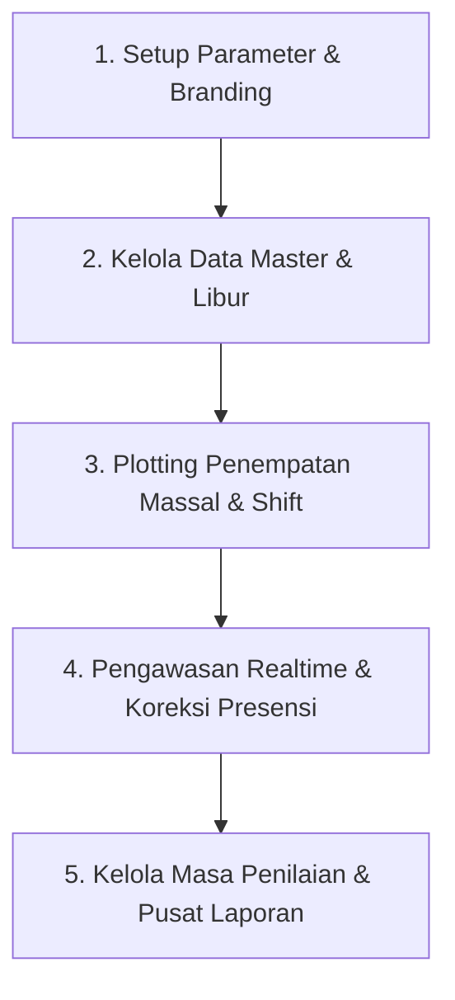
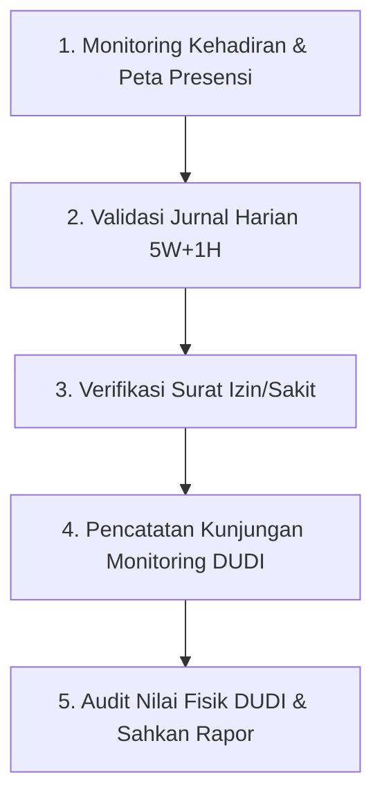
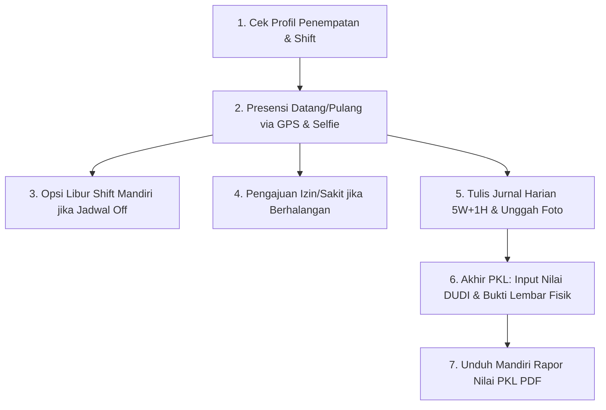

# 📘 Panduan Alur Kerja Lengkap Sistem Informasi PKL (PKLku)

Dokumen ini berisi panduan alur kerja (*standard operating procedure / workflow*) operasional aplikasi **PKLku** untuk tiga peran pengguna: **Administrator (Panitia PKL)**, **Guru Pembimbing Sekolah**, dan **Murid (Siswa PKL)**.

---

## 🗺️ Diagram Alur Utama Sistem (End-to-End Workflow)

```mermaid
graph TD
    subgraph Fase 1: Persiapan, Kebijakan & Master Data
        A1[Admin: Konfigurasi Parameter, Branding, Jam Multi-Shift & Kuota Libur] --> A2[Admin: Setup Tahun Ajaran, Jurusan, Kelas & Libur Nasional]
        A2 --> A3[Admin: Master Guru, Siswa & Mitra DUDI Geofence]
        A3 --> A4[Admin: Plotting Penempatan WFO/WFA/Hybrid, Shift Kerja & Hari Libur]
        A4 --> A5[Siswa & Guru Menerima Akun & Akses Sistem]
    end

    subgraph Fase 2: Pelaksanaan PKL Operasional Harian
        A5 --> B1[Siswa: Presensi Datang & Pulang GPS/Selfie/Watermark]
        A5 --> B2[Siswa: Tandai Libur Shift Mandiri Kuota Mingguan]
        A5 --> B3[Siswa: Pengajuan Izin/Sakit + Lampiran Surat]
        B3 --> B4[Guru/Admin: Verifikasi & Persetujuan Izin]
        A5 --> B5[Siswa: Tulis Jurnal Harian 5W+1H + Foto Dokumentasi]
        B5 --> B6[Guru: Periksa, Validasi & Beri Catatan Jurnal]
        A5 --> B7[Guru: Kunjungan Monitoring DUDI + Catatan Evaluasi & Foto]
        B7 --> B8[Guru: Cetak Laporan Kunjungan DUDI PDF]
        B1 --> B9[Sistem: Cron Auto-Absent Otomatis Lewati Libur Shift/Izin/Libur DUDI]
    end

    subgraph Fase 3: Pasca PKL, Evaluasi Nilai & Pelaporan
        C1[Admin: Buka Saklar Masa Penilaian] --> C2[Siswa: Input Nilai DUDI + Upload Scan Lembar Fisik + Capaian TP]
        C2 --> C3[Guru: Verifikasi Bukti Fisik DUDI + Input Nilai Sekolah & TP]
        C3 --> C4[Guru: Pengesahan Nilai Akhir PKL]
        C4 --> C5[Siswa & Admin: Unduh Rapor Nilai PKL PDF Resmi]
        C4 --> C6[Admin & Guru: Ekspor Rekap Presensi PDF/Excel & Jurnal PDF]
    end
```

---

## 1. 🛠️ Alur Kerja Administrator (Panitia PKL)

Administrator memegang kendali penuh atas manajemen parameter sekolah, data master, plotting penempatan, kebijakan shift kerja, pengumuman sekolah, serta penerbitan laporan akhir dan rekapitulasi data.



### Tahap 1: Konfigurasi Parameter & Branding Sekolah (`/setting`)
1. **Pengaturan Identitas & Kop Resmi**:
   - Menentukan Nama Sekolah Resmi, Alamat Lengkap, dan Kabupaten/Kota Sekolah (sebagai titimangsa tanda tangan otomatis pada dokumen PDF).
   - Mengunggah Logo Sekolah resmi beresolusi tinggi atau memilih opsi icon default.
   - Mengisi Nama Kepala Sekolah beserta NIP untuk lembar pengesahan rapor.
   - Menyesuaikan teks petunjuk footer rapor dan copyright footer login.
2. **Pengaturan Jam Multi-Shift & Geofence**:
   - Mengatur konfigurasi jam buka masuk, batas terlambat, dan jam pulang untuk 4 varian shift standar: **Shift Reguler**, **Shift Pagi**, **Shift Siang**, dan **Shift Sore**.
   - Menentukan radius toleransi geofence default dalam meter (misal: `50` meter).
   - Menentukan **Kuota Libur Shift Mingguan** (misal: `2` hari untuk DUDI 5 hari kerja, atau `1` hari untuk DUDI 6 hari kerja).
3. **Pengaturan Bobot Rapor**:
   - Menentukan bobot kontribusi nilai Guru Sekolah vs Nilai Industri DUDI (contoh: 50% - 50%).

### Tahap 2: Manajemen Master Data (`/master-data/*`)
1. **Tahun Ajaran, Jurusan, dan Kelas**:
   - Menyiapkan Tahun Ajaran aktif (misal: `2026/2027`), daftar kompetensi keahlian/jurusan, dan rombel kelas.
2. **Sinkronisasi Hari Libur Nasional**:
   - Melakukan sinkronisasi tanggal merah dan cuti bersama nasional secara otomatis melalui API kalender Indonesia, serta menambahkan hari libur khusus internal sekolah.
3. **Pendaftaran Guru & Siswa**:
   - Menginput akun pengguna atau memanfaatkan fitur **Impor Excel Massal** untuk ratusan siswa/guru sekaligus.
   - Tersedia fitur **Reset Password Massal** jika siswa/guru mengalami kendala login.
4. **Registrasi Mitra DUDI & Penentuan Titik Koordinat**:
   - Memasukkan profil DUDI, nama pembimbing industri/PIC, kontak WhatsApp, dan alamat.
   - Mengunci titik koordinat (**Latitude & Longitude**) serta radius toleransi geofence khusus DUDI via peta interaktif Google Maps.

### Tahap 3: Plotting Penempatan Siswa (`/penempatan`)
1. **Plotting Massal Siswa**:
   - Memilih rombel siswa dari kelas yang sama, menautkan ke Mitra DUDI tujuan, serta menunjuk Guru Pembimbing Sekolah.
2. **Konfigurasi Skema Kerja Fleksibel**:
   - Menentukan model kerja: **100% WFO**, **100% WFA**, atau **Hybrid**.
   - Pada model Hybrid, Admin menentukan hari-hari spesifik siswa bekerja dari mana saja (WFA), sehingga geofence dibebaskan pada hari tersebut.
3. **Konfigurasi Jam & Shift Kerja**:
   - Memilih template: **Shift Reguler**, **Shift Pagi**, **Shift Siang**, **Shift Sore**, **Rolling Shift (Auto-Detect)**, atau **Kustom Jam Khusus**.
   - Untuk DUDI dengan jam kerja unik (misal ritel hotel `14:00 - 21:00`), Admin mengetikkan jam secara mandiri.
4. **Penetapan Hari Libur DUDI**:
   - Menentukan jadwal libur rutin mingguan siswa (contoh: *Sabtu & Minggu*, atau *Minggu saja*).

### Tahap 4: Pengumuman & Pengawasan Presensi Real-Time (`/presensi`)
1. **Penerbitan Pengumuman**:
   - Mengunggah surat edaran atau pengumuman penting sekolah yang ditargetkan ke seluruh siswa, guru, atau kustom.
2. **Pengawasan Kehadiran Realtime**:
   - Memantau siswa yang hadir tepat waktu, terlambat, izin, sakit, libur shift, maupun yang belum presensi.
3. **Input Presensi Manual & Koreksi**:
   - Jika siswa mengalami kendala gawai rusak/baterai habis, Admin dapat melakukan input presensi manual atau mengoreksi jam dan status presensi siswa.

### Tahap 5: Buka Masa Penilaian & Ekspor Dokumen (`/laporan`)
1. **Aktivasi Saklar Penilaian**:
   - Membuka akses penginputan nilai bagi siswa dan guru menjelang berakhirnya periode PKL.
2. **Pusat Laporan & Ekspor Multi-Format**:
   - **Ekspor Rekapitulasi Presensi**: Format **PDF Dokumen** (Portrait Harian, Landscape Mingguan/Bulanan/Kustom) atau format **Excel (.xlsx)** lengkap dengan statistik.
   - **Ekspor Rekapitulasi Jurnal**: Format **PDF Dokumen** per periode tanggal atau per siswa.
   - **Unduhan Cepat Dokumen Siswa**: Tombol akses cepat unduh Presensi PDF, Jurnal PDF, dan Rapor Nilai PDF per siswa.

---

## 2. 👨‍🏫 Alur Kerja Guru Pembimbing Sekolah

Guru Pembimbing bertugas memantau perkembangan harian siswa bimbingannya, memvalidasi jurnal aktivitas, memberikan persetujuan izin, melakukan kunjungan ke industri, dan mengesahkan nilai akhir kelulusan.



### Tahap 1: Pemantauan Siswa Bimbingan & Presensi Realtime (`/dashboard` & `/monitoring`)
1. **Dashboard Khusus Guru**:
   - Mengetahui daftar lengkap siswa bimbingan beserta penempatan DUDI masing-masing.
   - Memeriksa status kehadiran harian siswa bimbingan secara realtime.
2. **Peta Sebaran Titik Presensi**:
   - Membuka peta interaktif yang memetakan titik koordinat selfie siswa bimbingan saat melakukan *check-in* dan *check-out*.

### Tahap 2: Validasi & Umpan Balik Jurnal PKL Siswa (`/jurnal`)
1. **Pemeriksaan Jurnal Harian**:
   - Notifikasi lonceng akan memberi tahu jumlah jurnal baru yang menunggu pemeriksaan.
   - Membaca deskripsi tugas yang disusun dengan kaidah 5W+1H serta meninjau foto dokumentasi kegiatan siswa.
2. **Aksi Verifikasi**:
   - Menekan tombol **"Setujui"** jika laporan kegiatan sesuai.
   - Menekan tombol **"Tolak / Revisi"** disertai catatan arahan perbaikan jika isi jurnal kurang lengkap.

### Tahap 3: Persetujuan Surat Izin / Sakit (`/presensi/izin`)
1. **Meninjau Pengajuan**:
   - Memeriksa alasan permohonan izin/sakit siswa bimbingan beserta lampiran foto surat keterangan dokter / surat izin orang tua.
2. **Memberikan Status**:
   - Menyetujui atau menolak pengajuan izin. Data kehadiran siswa otomatis terupdate menjadi *Izin (Disetujui)* atau *Sakit (Disetujui)* tanpa terkena sanksi Alpha.

### Tahap 4: Pelaksanaan & Laporan Kunjungan Monitoring DUDI (`/kunjungan`)
1. **Pencatatan Kunjungan Industri**:
   - Menginput agenda kunjungan ke mitra DUDI: tanggal, jenis kunjungan (*Pengantaran, Monitoring Rutin, Evaluasi Tengah, Penjemputan*), catatan evaluasi pembimbing industri, dan wajib unggah **Foto Dokumentasi Kunjungan**.
2. **Ekspor Laporan Kunjungan PDF**:
   - Mengunduh rekapitulasi lembar laporan kunjungan resmi dalam format PDF ber-kop sekolah sebagai bukti fisik kinerja pembimbingan.

### Tahap 5: Audit Bukti Fisik DUDI, Input Nilai Sekolah & Pengesahan Rapor (`/penilaian`)
1. **Audit Lembar Nilai Fisik Industri**:
   - Membuka tautan pratinjau **Berkas Bukti Lembar Nilai DUDI** yang diunggah siswa untuk mencocokkan keaslian nilai angka dengan stempel basah/tanda tangan industri.
2. **Input Nilai Aspek Sekolah & Keterangan TP**:
   - Menginput nilai aspek internal sekolah (Laporan PKL, Sikap/Soft Skill, Ujian/Presentasi).
   - Meninjau atau menyempurnakan narasi Keterangan Capaian per Tujuan Pembelajaran (TP).
3. **Pengesahan & Penerbitan Rapor**:
   - Menekan tombol **"Simpan & Sahkan Penilaian"**. Nilai akhir gabungan dihitung otomatis dan lembar **Rapor Penilaian PKL (PDF)** langsung terbit.

---

## 3. 🎓 Alur Kerja Murid (Siswa PKL)

Siswa melaksanakan operasional magang sehari-hari secara mandiri melalui antarmuka web yang responsif di ponsel pintar (*smartphone*).



### Tahap 1: Informasi Penempatan & Jadwal Kerja (`/dashboard`)
1. Siswa melihat profil penempatan: Nama Mitra DUDI, Lokasi & Radius Geofence, Guru Pembimbing Sekolah, Pembimbing Lapangan, Skema Kerja (WFO/WFA/Hybrid), dan Jam Shift Kerja.

### Tahap 2: Presensi Harian Masuk & Pulang (`/presensi`)
1. **Check-In (Presensi Masuk)**:
   - Membuka halaman presensi saat jam kerja dimulai.
   - Mengaktifkan GPS gawai. Jika posisi berada dalam radius geofence kantor DUDI (atau hari tersebut terjadwal WFA), preview kamera selfie terbuka.
   - Mengambil foto selfie di lingkungan kerja dan menekan **"Check In Sekarang"**. Foto selfie otomatis diberi watermark digital (tanggal, waktu, koordinat, status kerja).
2. **Check-Out (Presensi Pulang)**:
   - Saat jam kerja berakhir, siswa kembali mengambil foto selfie dan menekan **"Check Out Sekarang"**.

### Tahap 3: Penggunaan Fitur "Libur Shift Mandiri" (Untuk Jadwal Rolling/Roster)
1. Jika tempat DUDI menerapkan sistem libur bergantian acak (*roster/rolling day-off* non-Sabtu/Minggu), siswa membuka menu **Presensi** pada hari liburnya.
2. Klik tombol **"🌴 Tandai Libur Shift Hari Ini"** (sistem menampilkan sisa kuota mingguan, default max 2 hari/minggu).
3. Halaman presensi beralih ke mode Libur Shift dan siswa **bebas dari sanksi Alpha Cron Job**.
4. Jika mendadak dipanggil masuk bekerja oleh supervisor industri, siswa dapat menekan tombol **"Batalkan Libur (Masuk Bekerja)"** untuk membuka kembali tombol presensi.

### Tahap 4: Pengajuan Surat Izin / Sakit (`/presensi/izin`)
1. Jika berhalangan hadir karena sakit atau urusan penting yang sah, siswa membuka menu **Izin & Sakit**.
2. Memilih tipe (*Sakit* atau *Izin*), menentukan rentang tanggal, menuliskan alasan, dan melampirkan foto surat dokter / surat izin orang tua.
3. Notifikasi lonceng akan memberi tahu siswa jika pengajuan telah disetujui oleh Guru Pembimbing.

### Tahap 5: Pengisian Jurnal Harian 5W+1H (`/jurnal`)
1. Membuka menu **Jurnal Harian** setiap selesai bertugas di industri.
2. Menuliskan deskripsi pekerjaan secara sistematis mengikuti kaidah **5W + 1H**:
   - **What:** Pekerjaan/tugas apa yang dikerjakan hari ini?
   - **Why:** Apa fungsi/tujuan pekerjaan tersebut?
   - **Where:** Di bagian/divisi mana tugas dilakukan?
   - **When:** Kapan waktu dan berapa lama pelaksanaannya?
   - **Who:** Bersama siapa / di bawah instruksi siapa pekerjaan dilaksanakan?
   - **How:** Bagaimana langkah-langkah teknis pengerjaan dan hasilnya?
3. Mengunggah 1 foto dokumentasi pekerjaan sebagai bukti fisik aktivitas magang.

### Tahap 6: Penginputan Nilai DUDI & Unggah Bukti Lembar Fisik (`/penilaian`)
1. Menerima lembar sertifikat/penilaian fisik asli yang telah dinilai, ditandatangani, dan dicap basah oleh Mitra DUDI.
2. Ketika masa penilaian dibuka oleh Admin, siswa membuka menu **Penilaian PKL**.
3. Memasukkan nilai angka per indikator industri sesuai lembar fisik.
4. Mengisi deskripsi **Keterangan Capaian per Tujuan Pembelajaran (TP)**.
5. Mengunggah scan/foto berkas bukti fisik lembar nilai DUDI (format JPG, PNG, atau PDF).
6. Menekan tombol **"Kirim Nilai DUDI"**.

### Tahap 7: Penerbitan & Unduh Mandiri Rapor Nilai PKL PDF Resmi (`/penilaian`)
1. Setelah Guru Pembimbing memverifikasi berkas fisik dan mengesahkan nilai akhir, status penilaian berubah menjadi **"Sudah Diverifikasi & Disahkan"**.
2. Siswa dapat langsung mengunduh berkas resmi **Rapor Penilaian PKL (PDF)** lengkap dengan tanda tangan digital kepala sekolah dan pembimbing.

---

## ⚙️ Mekanisme Otomatisasi Sistem Cerdas

1. **Cron Auto-Absent Protection**:
   - Setiap malam pukul `21:00`, sistem menjalankan cron job untuk mencatat status **Alpha** pada siswa yang tidak hadir.
   - Cron secara cerdas **melewati (*skip*)** siswa yang:
     - Telah melakukan presensi masuk.
     - Berstatus `Libur Shift` mandiri.
     - Memiliki izin/sakit yang telah disetujui.
     - Berada pada hari libur nasional atau jadwal libur rutin DUDI.
2. **Engine Auto-Detect Multi-Shift (Rolling Shift)**:
   - Pada siswa dengan mode penempatan *Rolling Shift*, sistem secara cerdas mencocokkan jam presensi masuk siswa dengan jendela waktu Shift Pagi, Shift Siang, atau Shift Sore sekolah tanpa perlu diubah manual.
3. **Digital Watermarking Engine**:
   - Setiap foto presensi yang diunggah otomatis di-watermark dengan label tanggal, jam, koordinat GPS, serta label skema kerja `(WFO)` atau `(WFA)`.

---

## 📊 Matriks Fitur & Hak Akses Peran

| Modul & Fitur Sistem | Administrator | Guru Pembimbing | Siswa / Murid |
|---|:---:|:---:|:---:|
| **Konfigurasi Parameter, Branding, Jam Shift & Kuota Libur** | ✅ Penuh | ❌ | ❌ |
| **Kelola Master Data (Tahun Ajaran, Jurusan, Kelas, Libur)** | ✅ Penuh | ❌ | ❌ |
| **Kelola Akun Guru, Siswa & Reset Password** | ✅ Penuh | ❌ | ❌ |
| **Plotting Penempatan (WFO/WFA/Hybrid, Multi-Shift, Libur)** | ✅ Penuh | ❌ | ❌ |
| **Presensi Selfie & GPS Masuk/Pulang** | ❌ | ❌ | ✅ Mandiri |
| **Fitur Libur Shift Mandiri (Kuota Mingguan)** | ❌ | ❌ | ✅ Mandiri |
| **Input / Koreksi Presensi Manual** | ✅ Penuh | ✅ Guru Pembimbing | ❌ |
| **Pengajuan Surat Izin / Sakit** | ❌ | ❌ | ✅ Mandiri |
| **Persetujuan Surat Izin / Sakit** | ✅ Cadangan | ✅ Utama | ❌ |
| **Tulis Jurnal Harian Kaidah 5W+1H & Foto** | ❌ | ❌ | ✅ Mandiri |
| **Pemeriksaan & Validasi Jurnal Siswa** | ❌ | ✅ Utama | ❌ |
| **Input Laporan Kunjungan Monitoring DUDI & Foto** | ✅ Monitoring | ✅ Utama | ❌ |
| **Buka / Tutup Saklar Masa Penilaian** | ✅ Penuh | ❌ | ❌ |
| **Input Nilai DUDI + Unggah Bukti Lembar Fisik & TP** | ❌ | ❌ | ✅ Mandiri |
| **Audit Nilai Fisik DUDI, Nilai Sekolah & Sahkan Nilai** | ❌ | ✅ Utama | ❌ |
| **Unduh Rapor Penilaian PKL PDF Resmi** | ✅ Penuh | ✅ Penuh | ✅ Mandiri |
| **Ekspor Rekapitulasi Presensi (PDF & Excel)** | ✅ Penuh | ✅ Siswa Bimbingan | ❌ |
| **Ekspor Rekapitulasi Jurnal (PDF)** | ✅ Penuh | ✅ Siswa Bimbingan | ❌ |
| **Penerbitan Pengumuman Sekolah** | ✅ Penuh | ❌ | ❌ |

---

*Dokumen ini diperbarui secara berkala sebagai standar operasional prosedur implementasi aplikasi **PKLku** versi 2.3.*
